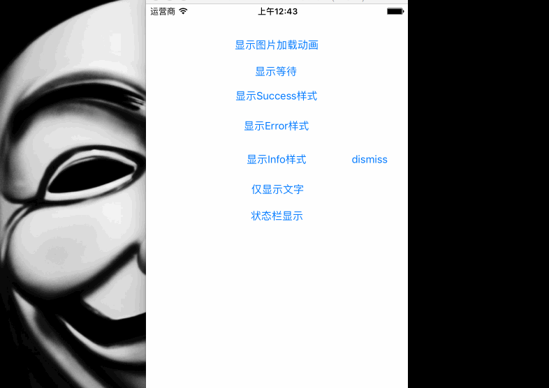

# SJProgressHUD




####基本用法
- 除了动画图片API以外的API,都是默认3秒后移除,如需手动移除只需将`autoRemove 参数 传入 false`

```swift
@IBAction func loadImage(sender: AnyObject) {
        var images = Array<UIImage>()
        for i in 1...31 {
            let patch =  NSBundle.mainBundle().pathForResource("load_\(i)@2x.png", ofType: nil, inDirectory: nil)
            let image = UIImage(contentsOfFile: patch!)
            images.append(image!)
        }
        SJProgressHUD.showWaitingWithImages(images)
    }
    @IBAction func Waiting(sender: AnyObject) {
        SJProgressHUD.showWaiting("正在加载中......")
    }
    @IBAction func Success(sender: AnyObject) {
        SJProgressHUD.showSuccess()
    }
    @IBAction func Error(sender: AnyObject) {
        SJProgressHUD.showError()
    }
    @IBAction func Info(sender: AnyObject) {
        SJProgressHUD.showInfo()
    }
    @IBAction func OnlyText(sender: AnyObject) {
        SJProgressHUD.showOnlyText("这是打酱油的!!这是打酱油的!!这是打酱油的!!这是打酱油的!!这是打酱油的!!这是打酱油的!!")
    }
    @IBAction func statusBar(sender: AnyObject) {
        SJProgressHUD.showStatusBarWithText()
    }
    @IBAction func dismiss(sender: AnyObject) {
        SJProgressHUD.dismiss()
    }

```

`目前还有个BUG,横屏时状态栏显示位置不对,不知道咋解决`
